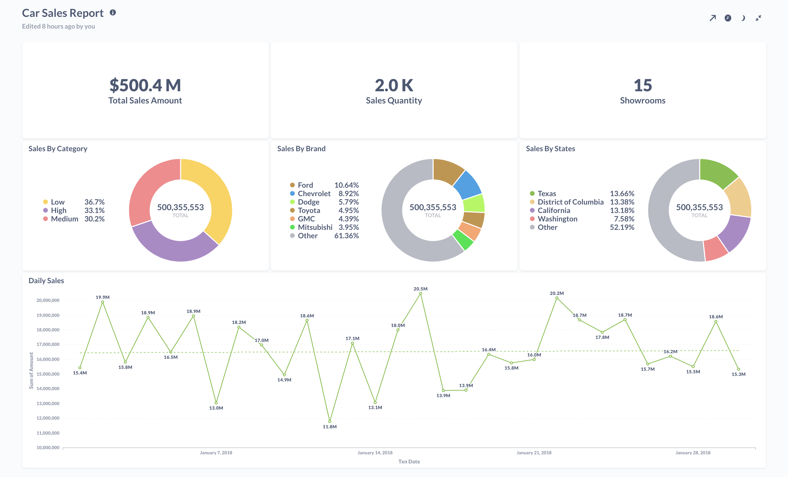

# AWS Infrastructure deployment to explore Big Data Analytics

Deploys various AWS resources using Terraform to get started with Big Data Analytics.

Refer to DWBI articles at [https://dwbi.org/categories/36/aws-analytics](https://dwbi.org/categories/36/aws-analytics)

## Resources

The following AWS resources will be deployed by Terraform:

- 1 Virtual Private Cloud
- 3 Private Subnets
- 3 Public Subnets
- 1 Internet Gateway
- 1 NAT Gateway for outbound internet access
- 1 Elastic IP for NAT Gateway
- 2 Routing tables (for Public and Private subnet for routing the traffic)
- 1 S3 VPC Endpoint
- 1 EC2 Instance as Datagen Server (with corresponding Security Group & SSH Key)^
- 2 S3 Buckets (Datagen & Resultset)
- 1 Athena Resources (Workgroup, Database, 8 Glue Catalog Tables & a Named Query)
- 1 Redshift Cluster (Subnet Group, Parameter Group)
- 1 EC2 Instance as Metabase Server (with corresponding Security Group & SSH Key)
- 1 EMR Cluster (Security Config, Scaling Policy, Instance Fleet, Instance Group)
- 1 OpenVPN Access Server

^ This server will be self destroyed after the TPCH data generation completes.

All instances will be deployed in Private Subnet.

## Athena

Refer to 

## Redshift

Create the tables & analyze data using Redshift. Refer to 

## Visualize Data using Metabase

Next you can use Metabase, to View & generate a Report from the Redshift database.


## EMR

Check the EMR Steps run status and Verify the datasets in Hive tables.

### Prerequisite

Terraform is already installed in local machine.

## Usage

- Clone this repository
- Generate & setup IAM user Access & Secret Key
- Generate a AWS EC2 Key Pair in the region where you want to deploy the Resources
- Add the below Terraform variable values

### terraform.tfvars

```
keypair_name = "aws-bda"

data_volume_gb = 10

vpn_admin_password = "asdflkjhgqwerty1234"
```

- Add the below variable values as Environment Variables

```
export AWS_ACCESS_KEY_ID="access_key"

export AWS_SECRET_ACCESS_KEY="secret_key"

export AWS_DEFAULT_REGION="us-east-2"
```

- Change other variables in variables.tf file if needed
- terraform init
- terraform plan
- terraform apply -auto-approve -refresh=false
- Finally browse the AWS Management Console and explore the other services.

### Destroy Resources

- terraform state rm module.instances.aws_instance.datagen_server
- terraform destroy -auto-approve -refresh=false

/_
terraform state rm module.athena.aws_athena_database.bigdata_db
_/
